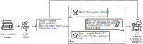

# SocraticBench

<p align="center">

</p>

SocraticBench is a research framework and benchmark dedicated to building and evaluating LLMs that teach by asking,
not just answering — with a commitment to developing the best AI tutors for real learning.

## 🧠 Motivation

Most AI tutors are built to answer questions, not to teach students how to think. While this makes them fast and useful,
it also risks promoting shallow learning: students get answers, but not understanding.

The Socratic Method offers a powerful alternative — teaching through questions rather than answers. It encourages
students to reflect, reason, and discover insights on their own. But today’s language models are rarely evaluated on
their ability to teach Socratically.

SocraticBench fills this gap. It is a research-grade library and benchmark for:

* Generating Socratic dialogues between a simulated teacher and student (both LLMs)
* Evaluating conversations using a calibrated LLM-as-a-judge, trained to assess Socratic quality
* Exploring how well different LLMs (e.g. GPT-4, Claude, LLaMA) perform as Socratic teachers

The goal is not to make chatbots more helpful — it's to make them better at fostering critical thinking and deep
understanding.

# ✨ Features

* Modular pipeline with customizable Stage components.
* Supports multi-agent setups: Student, Teacher, and Judge agents with distinct roles.
* Built-in dataset loader for Princeton NLP's textbook chapters.
* Robust parsing and retry logic for prompting unreliable LLM outputs.
* Evaluation agent that follows a strict Socratic rubric, checking:
    * Topic coverage
    * Adherence to Socratic principles (e.g. no direct answers)
    * Indicators of student understanding

# 🔎 Overview

The pipeline extracts data from educational contents and produces conversation seeds, containing a set of
discussion topics and an opening question. Two LLMs playing the roles of a teacher and a student discuss on the topic
following a loop. At the end of the conversation, an LLM-as-a-judge rates the conversation as successful — covering the
topics, addressing the opening question, and respected the Socratic principles — or failed.



# 🛠️ Installation

You can use SocraticBench by installing it with:

```bash
pip install socratic-bench
```

Depending on the LLM provider you are planning to use (via OpenAI API, local models, etc.), you may need some additional
settings. We provide three alternative LLM implementations, and you must install the dependencies for the ones you're
using.

```bash
pip install socratic-bench[openai]        # if using OpenAI as backend
pip install socratic-bench[ollama]        # if using Ollama as backend
pip install socratic-bench[hf]            # if self-hosting LLMs with HF transformers
pip install socratic-bench[openai,ollama] # if a mix of Ollama and OpenAI
```

You'll also need to set up the API token if using OpenAI.

# 🧪 Usage

## Default benchmarking

```python
from openai import Client

from socratic_bench import StudentAgent, TeacherAgent, JudgeAgent, ConversationSeederAgent, socratic_bench, Record
from socratic_bench.llms.openai import OpenAILLM
from socratic_bench.readers import PrincetonChapters

# Define the LLM
client = Client()
llm = OpenAILLM("gpt-4o-mini", client)

# Specify the agents
seeder = ConversationSeederAgent(llm)
student = StudentAgent(llm)
teacher = TeacherAgent(llm)
judge = JudgeAgent(llm)

# Specify your data source
data_source = PrincetonChapters(Record, num_conversations=2)

# load the pipeline
pipeline = socratic_bench(data_source, seeder, student, teacher, judge)

# run it !
results, stats = pipeline.run()
```

Each Record in results contains:

* `seed.question:` the student's initial question
* `chat_history:` the full dialogue
* `assessment:` whether the teacher passed the Socratic criteria
* `feedback:` detailed explanation from the Judge agent decision
* `failure:` flag indicating whether the record encountered processing issues

## Composing your pipeline

Let's say, for example, you want to compose your own pipeline by eliminating certain steps and adding new others. You
can use the lower level API and create a mix of steps the way you wish. For example,

```python
from typing import List

from socratic_bench import Record, DataSource
from socratic_bench.agents import ConversationSeeder, Student, Teacher
from socratic_bench.pipeline import SocraticBench, Emitter
from socratic_bench.stages import SeedStage, Stage

data_source: DataSource[Record] =  # ...
seeder: ConversationSeeder =  # ...
students: List[Student] =  # ...
teacher: Teacher =  # ...


class GroupChatStage(Stage[List[Record], List[Record]]):
    """Chat stage that simulates a classroom"""

    def __init__(self, students: List[Student], teacher: Teacher):
        self._students = students
        self._teacher = teacher

    def process(self, sample: List[Record], emitter: Emitter[List[Record]]) -> None:
        ...  # your custom implementation


my_bench = (
    SocraticBench.from_data(data_source)
    .apply(SeedStage(seeder))  # standard seed generation
    .batch()  # grouping records for batch processing
    .apply(GroupChatStage(students, teacher))  # using a custom classroom for creating chat exchanges
    .flatten()  # flattening groups
    # .apply(EvaluationStage(judge)) -> You removed the evaluation step
)

results, stats = my_bench.run()
```

## Specifying your models

The pipeline relies on the abstraction of `socratic_bench.agents.LLM` abstraction. In principle, you can implement this
class and plug any LLM provider of your choice. We, however, provide three alternatives:

### OpenAI

```python
from openai import Client
from socratic_bench.llms.openai import OpenAILLM

client = Client()
llm = OpenAILLM("gpt-4o-mini", client)
```

### Ollama

```python
from ollama import Client
from socratic_bench.llms.ollama import OllamaLLM

client = Client(host="http://localhost:11434")
llm = OllamaLLM("mistral-small3.1:24b", client, num_ctx=5120, temperature=0.15)
```

### HF transformers

```python
import torch

from socratic_bench.llms.hf import HFLLM

llm = HFLLM(
    "mistralai/Mistral-Small-3.1-24B-Instruct-2503",
    model_kwargs={
        "trust_remote_code": True,
        "device_map": "cuda",
        "torch_dtype": torch.float16
    }
)
```

# 🔧 Extensibility

You can implement your own custom:

* LLM backend
* Student, Teacher, Judge agent behavior
* ConversationSeeder logic
* Evaluation rubrics

Simply subclass the relevant ABCs (abstract base classes) and plug them into the pipeline.

# 📊 Empirical Evaluation of State-of-the-art LLMs

We evaluated how well different LLMs can lead Socratic teaching dialogues by generating over 350 multi-turn
conversations between a simulated teacher and student.

Our experiments compared a range of models — including Gemma 3, LLaMA 3.3, Mistral-Small 3.1, GPT-4o, LearnLM 2.0, and
[EULER](https://github.com/GiovanniGatti/socratic-llm) (a fine-tuned Socratic LLM) — using the same seed questions and
student model. An LLM-as-a-judge (Qwen 32B) evaluated whether each teacher successfully guided the student to a deep
understanding. The results are displayed in the table bellow.

| **LLM**          | **Model Size (B)** | **Success Rate** | **95% CI**     |
|------------------|--------------------|------------------|----------------|
| EULER            | 3.82               | 18.3%            | [14.6%, 22.7%] |
| **Gemma 3**      | **27**             | **22.9%**        | [18.8%, 27.5%] |
| GPT-4o           | ---                | 17.4%            | [13.8%, 21.8%] |
| Llama3.3         | 70                 | 21.1%            | [17.2%, 25.7%] |
| MistralSmall 3.1 | 24                 | 20.9%            | [16.9%, 25.4%] |
| LearnLM 2.0      | ---                | 21.1%            | [17.2%, 25.7%] |

Key findings:

1. **Socratic teaching is hard:** Success rates were low across all models, with the best reaching only ~23% success.
2. **Bigger isn’t better:** Model size did not correlate with better Socratic teaching. Smaller models like
   Mistral-Small
   matched or outperformed larger ones like LLaMA-3.3.
3. **Gemma 3** was the top performer, but its lead over others was marginal within the confidence interval.

Even education-tuned LLMs underperformed: Both GPT-4o and LearnLM 2.0 scored below expectations.

Conversations improve with more turns, but gains plateau around 8 dialogue rounds.

<p align="center">

</p>

Why do LLMs fail? Common issues included not covering all topics or drifting off-topic. The core problem seems
structural: LLMs are trained to respond, not to teach.

<p align="center">

</p>

These results highlight a fundamental limitation of current LLMs: They’re not yet designed to lead structured,
goal-driven educational dialogues. Improving this may require moving from passive response models to ones trained for
proactive, guided instruction.

# ⚖️ Calibrating the Judge

To enable automatic evaluation of Socratic dialogues, we developed a prompt-guided LLM "judge" and validated it against
expert annotations. Our goal was to select LLMs that best align with human judgment, using Cohen’s κ (kappa) — a metric
that corrects for chance agreement in binary classification tasks.

## Expert Agreement

We began by generating a small set of dialogues using Mistral-Nemo, then asked two experts to independently rate 30
samples (Accept/Reject + justification). This yielded a Cohen’s κ = 0.50 (95% CI: [–0.047, 0.889]), indicating moderate
agreement but with wide uncertainty due to the small sample size.

| **Rater 1 \ Rater 2** | **Reject** | **Accept** |
|-----------------------|------------|------------|
| **Reject**            | 23         | 1          |
| **Accept**            | 3          | 3          |

🗂 Expert-annotated datasets: [expert-1.json](./datasets/human-eval/expert-1.json)
and [expert-2.json](./datasets/human-eval/expert-2.json).

After resolving disagreements, the experts produced a 30-sample consensus dataset and revised the judge LLM prompt. The
final prompt incorporates a short summary and checklist before giving a final verdict, drawing from Chain-of-Thought
prompting.

We then collected 50 more independent ratings from each expert, yielding a 130-sample labeled dataset used to evaluate
judge LLMs (see [merged.json](./datasets/human-eval/merged.json)).

## 📊 LLM Agreement with Expert Judgments

We benchmarked various open- and closed-source LLMs, comparing their outputs to expert judgments using Cohen’s κ. The
best-performing model, Qwen 3 (32B), achieved a κ of 0.26 — modest agreement but sufficient for approximate assessment.

| **Model Name**    | **Size** | **Cohen’s κ** | **95% CI**          |
|-------------------|----------|---------------|---------------------|
| Gemma 3           | 27B      | 0.255         | \[0.082, 0.419]     |
| GPT-4o            | N/A      | 0.212         | \[0.021, 0.405]     |
| GPT-4o-mini       | N/A      | 0.113         | \[0.047, 0.188]     |
| LLaMA 3.3         | 70B      | 0.063         | \[–0.052, 0.177]    |
| Mistral-Small 3.1 | 24B      | 0.226         | \[0.073, 0.378]     |
| Phi-4             | 14B      | 0.057         | \[–0.036, 0.149]    |
| Qwen 3 (1.7B)     | 1.7B     | 0.100         | \[–0.090, 0.295]    |
| Qwen 3 (14B)      | 14B      | 0.215         | \[0.027, 0.400]     |
| **Qwen 3 (32B)**  | **32B**  | **0.260**     | **\[0.077, 0.438]** |
| Qwen 3 (4B)       | 4B       | 0.134         | \[0.014, 0.261]     |
| Qwen 3 (8B)       | 8B       | 0.192         | \[0.027, 0.355]     |

# ⛁ Datasets

We are also releasing the experimental results on several open- and closed-source LLMs on the Socratic evaluation and
the expert annotated data for calibrating the judge model. Here are the files to watch for:

```
├── datasets
│   ├── evaluation                          # datasets used for evaluating LLMs
│   │   ├── seeds.json                      # the seed dataset used throughout experimentation
│   │   ├── int_{max_length}_{model}.json   # dataset containing detailed interactions between teacher/student agents
│   │   ├── eval_{max_length}_{model}.json  # dataset with the interactions traces + judge LLM evaluation
│   ├── human-eval                          # datasets containing expert annotated data
│   │   ├── seed-dataset.json               # seed dataset used to produce the inputs for annotators
│   │   ├── expert-{id}.json                # dataset with inputs independently annotated by individual {id}
│   │   ├── agreement.json                  # dataset containing final annotations after inter-annotator discussion
│   │   ├── merged.json                     # merge of expert-{id} + aggreement datasets
│   ├── judge-benchmark                     # datasets used for callibrating the LLM-as-a-judge
│   │   ├── {model}_{size}.json             # assessment dataset for {model} with {size}
```

# 🚨 Limitations

SocraticBench is an early step toward evaluating and improving Socratic teaching with LLMs. While it offers a
reproducible benchmark and valuable insights, several limitations are worth noting:

* **Limited human-annotated dataset:** Our expert evaluation set includes 130 annotated samples — sufficient for model
  comparisons, but too small for detailed subgroup analysis or robust generalization.

* **Moderate inter-annotator agreement:** Human evaluation of Socratic quality remains subjective. Our experts reached
  only
  moderate agreement ($\kappa = 0.50$), highlighting the challenge of defining "good teaching" even among humans.

* **Fixed prompts and judge setup:** We used a single prompting strategy for teacher LLMs and a fixed judge prompt to
  assess
  conversations. Alternative designs might yield different rankings.

* **Synthetic dialogues only:** The benchmark relies entirely on LLM-generated student responses. Real student
  interactions
  may be more complex and unpredictable.

These limitations are an opportunity for the community. We welcome contributions that extend SocraticBench with improved
prompts, new student/teacher models, or larger expert datasets.
